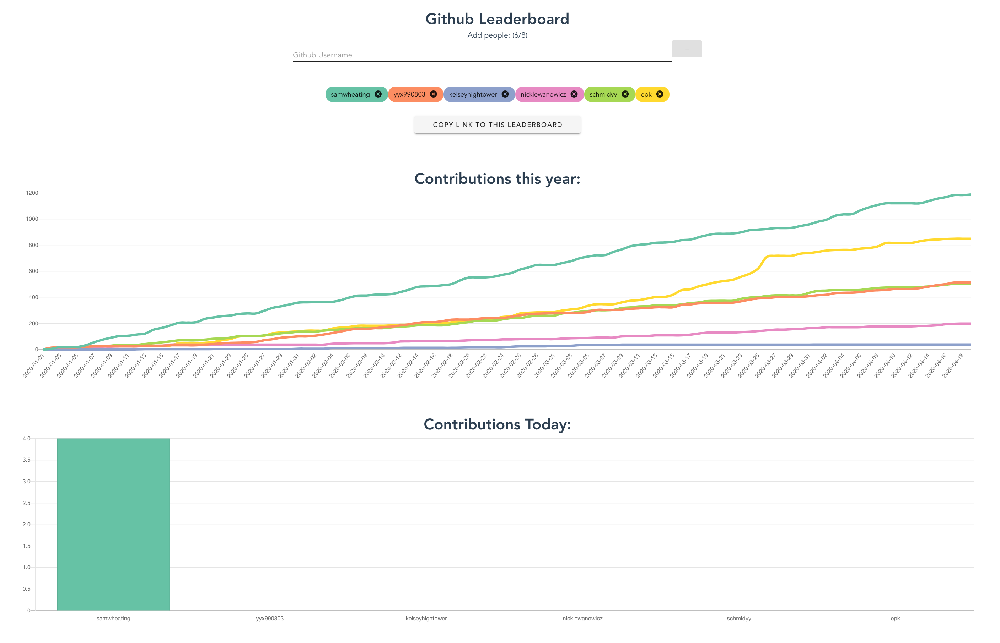

# Github Leaderboard

A Web App for comparing github activity between users, built as a practice project while learning frontend stuff.



Built with Vuie / Vuetify and using the github contributions API by [Sallar](https://github.com/sallar/github-contributions-api).

API endpoint found at `https://github-contributions-api.now.sh/v1/<username>`

## Developing

To set up:
```
npm install
```

To run a local server (at `https://localhost:8080`)
```
npm run serve
```
